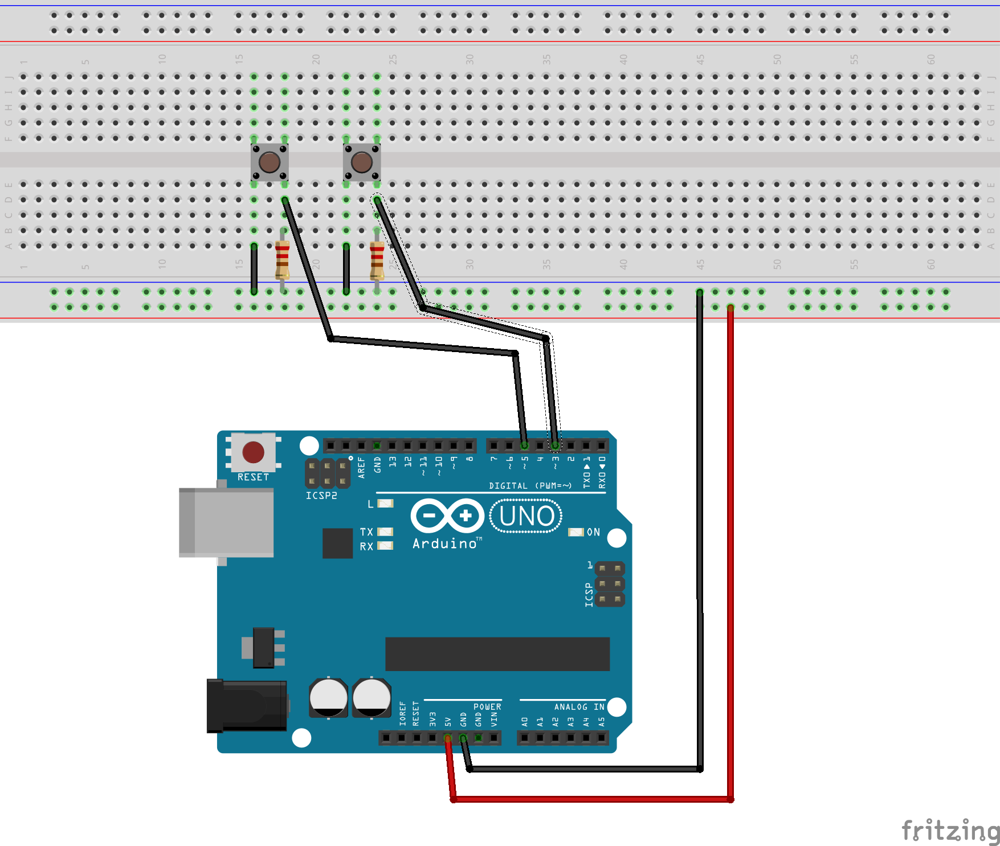

# Serial transmission test01

For this sketch you need:
- [ ] 2 x 220 Ohm resistors,
- [ ] 2 x Push buttons,
- [ ] 1 x Breadboard and
- [ ] 1 x Arduino

You can use the following scheme to connect the components:

Then upload the source code and you have your sketch working (maybe)